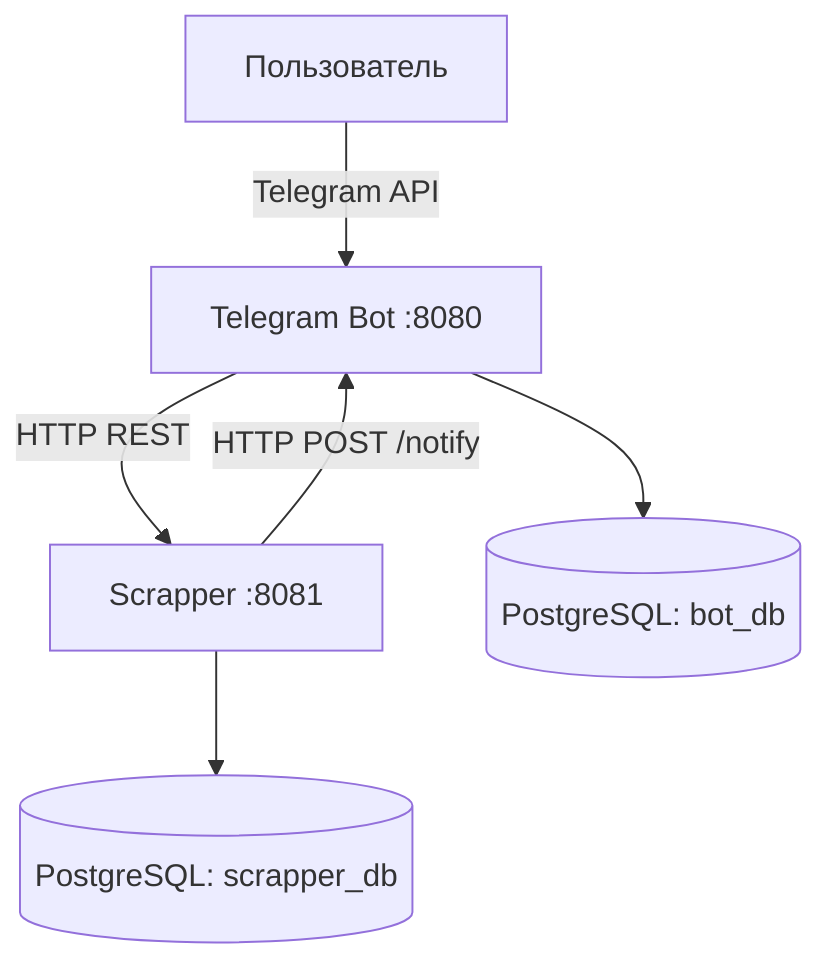

# Scrapper - Распределённая система мониторинга ссылок

## Обзор

Scrapper — это распределённое приложение для отслеживания изменений на веб-ресурсах с уведомлениями через Telegram. Система состоит из:

- **Telegram Bot** (порт 8080)
  - Обработка команд пользователя
  - Управление подписками
  - Отправка уведомлений
- **Scrapper Service** (порт 8081)
  - Периодическая проверка ресурсов
  - Обнаружение изменений контента
  - Инициирование уведомлений

## Технологический стек

| Компонент       | Технологии                          |
|-----------------|-------------------------------------|
| Бэкенд          | Java 23, Spring Boot 2.4.3          |
| Базы данных     | PostgreSQL (2 отдельных инстанса)   |
| Инфраструктура  | Docker, Docker Compose              |
| Сеть            | Пользовательская bridge-сеть        |
| Документация    | Swagger UI                          |

## Быстрый старт

### Предварительные требования

- Docker Engine ≥ 20.10.0
- Docker Compose ≥ 1.29.0
- Telegram аккаунт для тестирования

### Установка

1. Клонируйте репозиторий:
   ```bash
   git clone [repository-url] && cd scrapper
   ```

2. Настройте окружение:
   ```bash
   nano .env  # Заполните параметры
   ```

3. Запустите систему:
   ```bash
   docker-compose up --build -d
   ```

## Архитектура системы



## API Документация

Доступна после запуска:
- Бот: `http://localhost:8080/swagger-ui.html`
- Scrapper: `http://localhost:8081/swagger-ui.html`

## Команды бота

| Команда         | Описание                          | Пример               |
|-----------------|-----------------------------------|----------------------|
| `/start`        | Инициализация бота                | `/start`             |
| `/track <URL>`  | Добавить ресурс для отслеживания  | `/track https://example.com` |
| `/untrack <URL>`| Удалить ресурс                    | `/untrack https://example.com` |
| `/list`         | Список отслеживаемых ресурсов     | `/list`              |
| `/search <tag>` | Поиск по тегам                   | `/search news`       |

## Управление системой

### Мониторинг
```bash
# Статус контейнеров
docker-compose ps

# Логи в реальном времени
docker-compose logs -f bot
docker-compose logs -f scrapper
```

### Администрирование БД
```bash
# Подключение к БД бота
docker exec -it postgres_db psql -U $POSTGRES_USER -d bot_db

# Подключение к БД scrapper
docker exec -it postgres_db psql -U $POSTGRES_USER -d scrapper_db
```

### Резервное копирование
```bash
# Экспорт данных
docker-compose exec postgres pg_dump -U $POSTGRES_USER -d bot_db > bot_backup.sql
```

#### Воспользуйтесь файлом Test-Cases.md для проверки работоспособности по чек-листу
